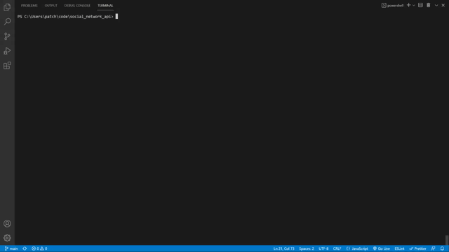

# Social Network API


Social Network API is an startup social app where users have thoughts to share and other users can input reactions to the users' thoughts. Built by using `MongoDB` to set up the database and `Insomnia` to test the api routes. This application utilizes NoSQL MongoDB.

## Table of Contents

* [Setup](#setup)
* [Usage](#usage)
* [Deployment](#deployment)
* [Contributing](#contributing)
* [License](#license)

## Setup
:floppy_disk:

The database uses the following npm:
- [Node Package Manager](https://nodejs.org/en/)
  - Run `npm install` in order to install the following npm package dependencies as specified in the `package.json`.
  - This will also help install express on your system and manage any other dependencies in your script.
- [Express](https://www.npmjs.com/package/express)
  - A minimal and flexible Node.js web application framework that provides a robust set of features to develop web and mobile applications. Facilitates the rapid development of Node based Web applications.
- [Mongoose](https://www.npmjs.com/package/mongoose)
  - Mongoose is a MongoDB object modeling tool designed to work in an asynchronous environment. Mongoose supports both promises and callbacks.

This repository requires [Insomnia Core](https://insomnia.rest/products/insomnia) to be utilized.

This repository uses [MongoDB](https://www.mongodb.com/) to set up the database, models and routes.

<br/>

### Model Setup

Model setup is such that `User` model is the overarching model. `User` self-reference itself for `Friends`. `User` is the parent model of `Thoughts`. `Reactions` is linked under `Thoughts`.

User Schema:
- username
- email
- thoughts `ref: 'Thought`
- friends `ref: 'User`

Thought Schema:
- thoughtText
- createdAt
- username
- userId
- reactions: [Reaction Schema]

Reaction Schema:
- reactionId
- reactionBody
- username
- createdAt

Example of the full model parameters of 2 users created, 1 thought and 1 reaction:
```js
[
	{
		"_id": "61ec2a216adcdaa257cfaf4e",
		"username": "User",
		"email": "user@email.com",
		"thoughts": [],
		"friends": [],
		"friendCount": 0
	},
	{
		"_id": "61ec29b96adcdaa257cfaf3b",
		"username": "Person3",
		"email": "person@email.com",
		"thoughts": [
			{
				"_id": "61ec29c26adcdaa257cfaf3e",
				"thoughtText": "Here's a cool thought...",
				"username": "Person3",
				"userId": "61ec29b96adcdaa257cfaf3b",
				"createdAt": "Jan 22nd, 2022 at 10:58 am",
				"reactions": [
					{
						"reactionBody": "Here's a cool reaction...",
						"username": "User",
						"_id": "61ec29da6adcdaa257cfaf45",
						"reactionId": "61ec29da6adcdaa257cfaf46",
						"createdAt": "2022-01-22T15:59:22.068Z"
					}
				],
				"reactionCount": 1
			}
		],
		"friends": [
			"61ec2a216adcdaa257cfaf4e"
		],
		"friendCount": 1
	}
]
```


## Usage

:computer:

After installing all the necessary dependencies, start the server by typing `npm start`.

Use Insomnia to test the api routes. Use the following api routes to test your data. Use `http://localhost:3001/...` for the Insomnia address.

<br/>

Walkthrough gif to `npm start` the server in your terminal:




<br/>

User Routes:

- `/api/users`
- `/api/users/:id`

User Inputs:

- GET all Users
- GET Users by ID
- POST User
- PUT User
- DEL User.

<br/>

Walkthrough gif of User routes:


<br/>

Friend Routes:

- `/api/users/:userId/friends`
- `/api/users/:userId/friends/:friendId`

Friend Inputs:

- POST friends
- DEL friends

<br/>

Walkthrough gif of Friend routes:


<br/>

Thought Routes:

- `/api/thoughts/`
- `/api/thoughts/<thoughtId>`

Thought Inputs:

- GET all Thoughts
- GET Thoughts by ID
- POST Thought
- PUT Thought
- DEL Thought.

<br/>

Walkthrough gif of Thoughts routes:


<br/>

Reaction Routes:

- `/api/thoughts/<thoughtId>/reactions`
- `/api/thoughts/<thoughtId>/reactions/<reactionId>`

Reaction Inputs:

- POST reactions
- DEL reactions

<br/>

Walkthrough gif of Reaction routes:


<br/>

Whenever the user is deleted, the user's associated thoughts are also deleted due to linking the user and thoughts through Mongoose promise all.

```js
  deleteUser({ params }, res) {
    Promise.all([
      Thought.deleteMany({ userId: params.id }),
      User.findOneAndRemove({ _id: params.id })
    ])
      .then(dbUserData => res.json(dbUserData))
      .catch(err => res.json(err));
  },
```

<br/>

Demonstration gif of deleting User and User's associated thoughts:


## Deployment

There is no deployment for this repository.

## Contributing

:octocat:

[paperpatch](https://github.com/paperpatch) </br>

## License

:receipt:

This project is licensed under MIT.